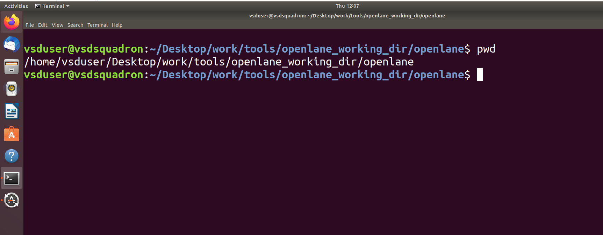
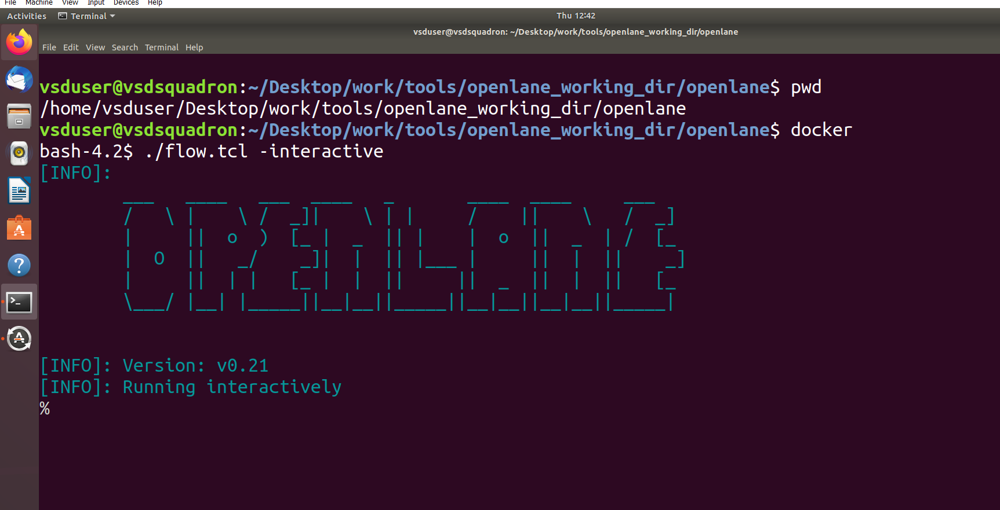
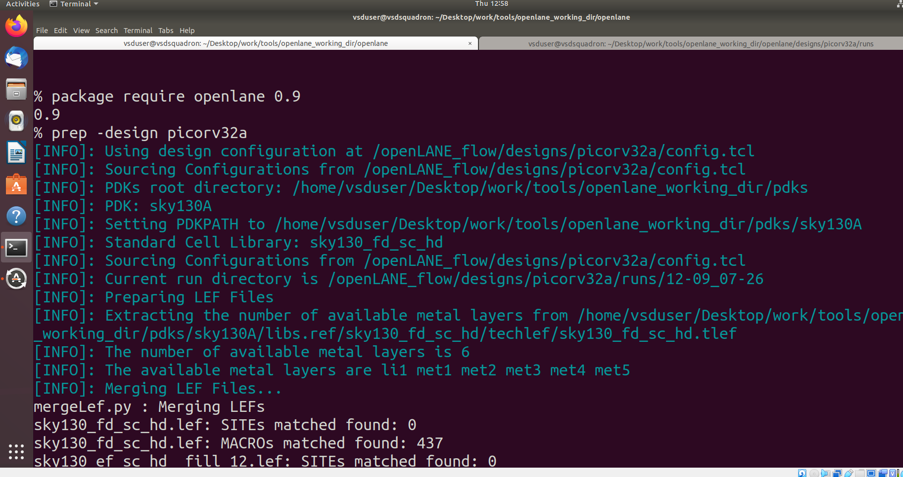
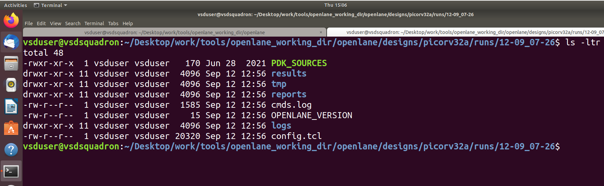

#####Day_1 - Synthesis ########

Step1: Launching the tool

 a) Open the terminal and go to the open-lane working director
     
  
 
 b) Type docker then the terminal will be changed into bash. After enterning into the bash type ./flow.tcl -interactive by this  
    we are forcing the tool to work in interactive mode 
    
    docker
    ./flow.tcl -interactive

  
 
 c) Now the tool is opened. Next step is loading the packages for that following commands are to used

    % package require openlane 0.9
    % prep -design picorv32a 
 
   
 
 d)  Review the files after design prep
     
   

