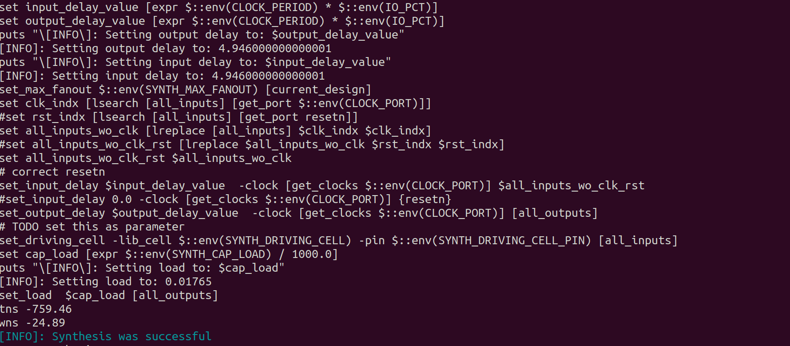

#####Day_1 - Synthesis ########

Step1: Launching the tool

 a) Open the terminal and go to the open-lane working directory.
     
  
 
 b) Type docker then the terminal will be changed into bash. After enterning into the bash type ./flow.tcl -interactive by this  
    we are forcing the tool to work in interactive mode 
    
    docker
    ./flow.tcl -interactive

  
 
 c) Now the tool is opened. Next step is loading the packages for that following commands are to used.

    % package require openlane 0.9
    % prep -design picorv32a 
 
   
 
 d)  Review the files after design prep:
     Go to openlane_working_dir > openlane > designs > picorv32a > runs > (current_date) > check whether log dir, results dir, reports dir are created.
     
   

Step 2: Running the Synthesis
  a) To run the Synthesis use 
     
     run_synthesis
    
    This will run both yosys & abc
 
 

