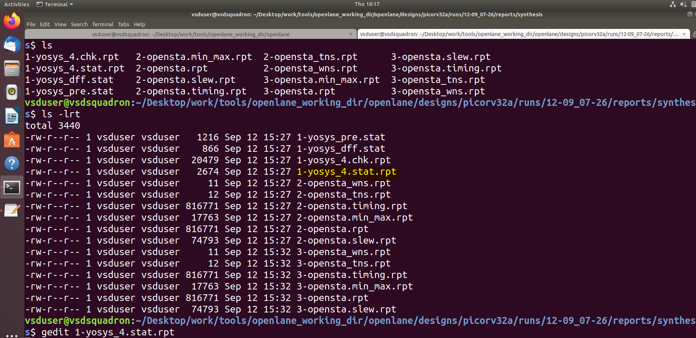

#####Day_1 - Synthesis ########

Step1: Launching the tool

 a) Open the terminal and go to the open-lane working directory.
     
  
 
 b) Type docker then the terminal will be changed into bash. After enterning into the bash type ./flow.tcl -interactive by this  
    we are forcing the tool to work in interactive mode 
    
    docker
    ./flow.tcl -interactive

  
 
 c) Now the tool is opened. Next step is loading the packages for that following commands are to used.

    % package require openlane 0.9
    % prep -design picorv32a 
 
   
 
 d)  Review the files after design prep:
     Go to openlane_working_dir > openlane > designs > picorv32a > runs > (current_date) > check whether log dir, results dir, reports dir are created.
     
   

Step 2: Running the Synthesis
 To run the Synthesis use 
     
   run_synthesis
    
 This will run both YOSYS & ABC
 

Step 3: Calculation of D-FF Ratio:
 Go to runs dir > <current_date dir> > synthesis > reports > open yosys_4.stat.rpt 

 
 This report will show the statistics of the design. From the stats calculate the dff ratio

 
 The Ratio of DFF is: 
 number of D-FF(dfxtp2)/total number of cells = 1613/14876 = 0.108429
 % of D-flip flop = 0.108429685 x 100 = 10.842968

