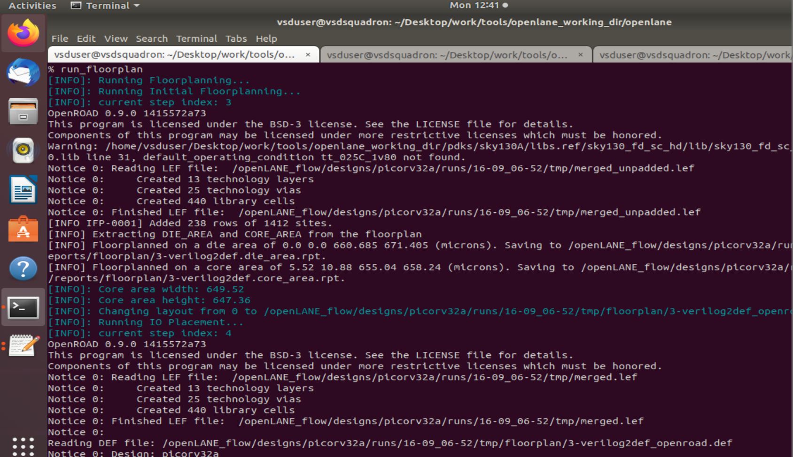
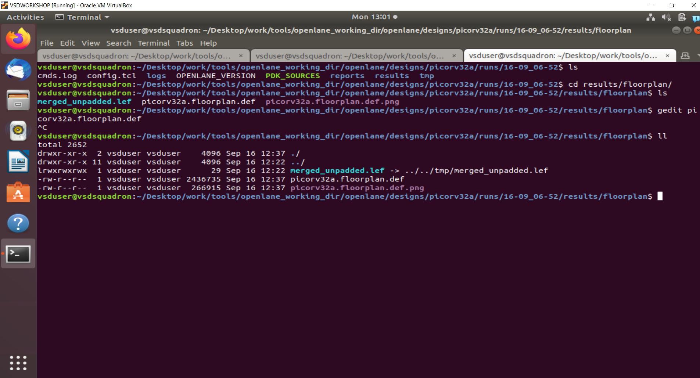
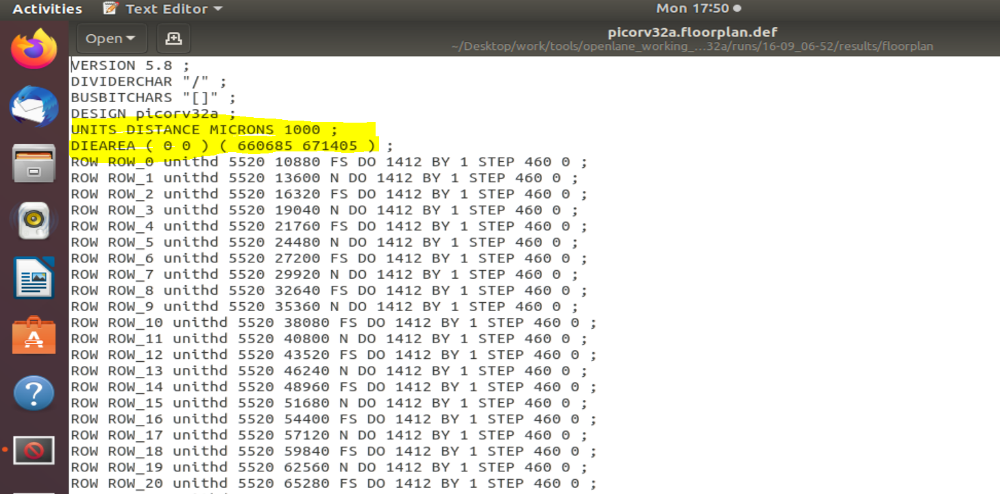
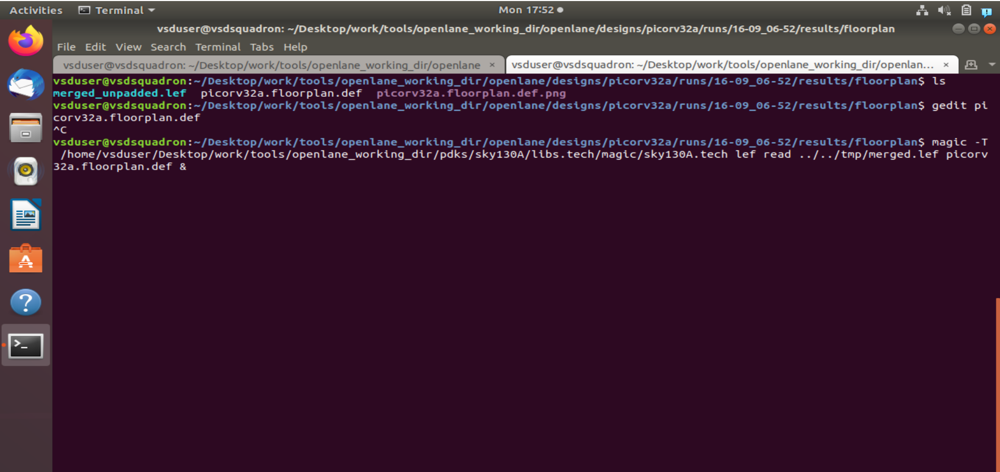
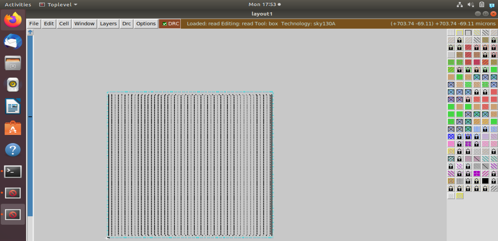
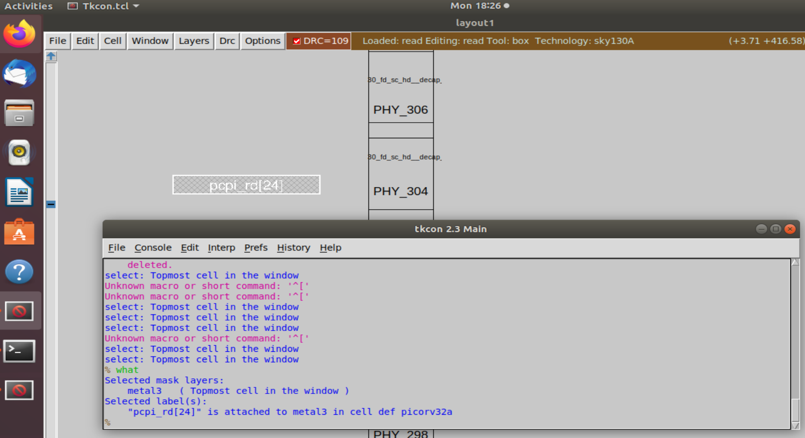
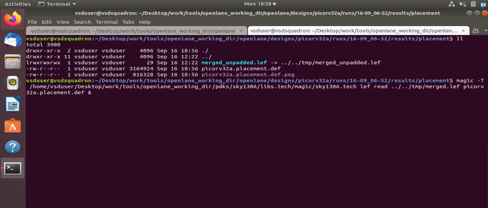
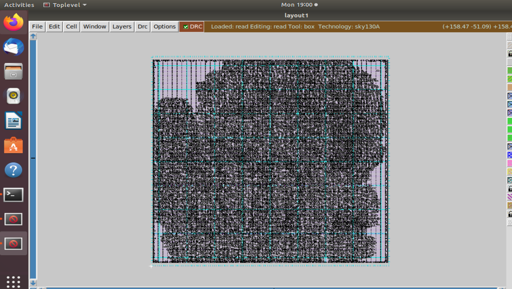

####Day 2 -Floorplan & Placement

Step 1: Launching the FP tool 
 Use the following commands in the openlane working dir which we used in Day 1
    
```console
     docker
     ./flow.tcl -interactive
     % package require openlane 0.9
     %prep design picorv32a
     %run_sunthesis
     %run_floorplan
```


 Go to openlane_working_dir > openlane > designs > picorv32a > current date > results > floorplan 

 

 Open .def file and check the Die area



Step 2: Calculation of Aspect ratio and Die Area
$$
 Core Utilization Factor = 0.35
 Die Area = Height * Width
 Aspect ratio = Height/Width 
 In this case 
 Height of Die = 671405/1000 = 671.405
 Width of Die  = 660685/1000 = 660.685
 Area of the die = Height of the Die * Width of the Die = 671.405 * 660.065 = 443587.212425
 Aspect Ratio = Height of the Die / Width of the Die = 671.405/660.065 = 1.016
$$

Step3 : Viewing the floorplan in the Magic 
 Navigate to results > floor plan and enter the below command

```console
 magic -T /home/vsduser/Desktop/work/tools/openlane_working_dir/pdks/sky130A/libs.tech/magtc/sky130A.tech lef read../../tmp/merged.lef picorv 32a.floorplan.def &
```





Step 4: Placement
 Run the following command for the placement using RePLACE
 ```console
 % run_placemnt
 ```
 Now navigate to results directory and view the placement in magic  
 ```console
 magic -T /home/vsduser/Desktop/work/tools/openlane_working_dir/pdks/sky130A/libs.tech/magtc/sky130A.tech lef read../../tmp/merged.lef picorv 32a.placement.def &
  ```





